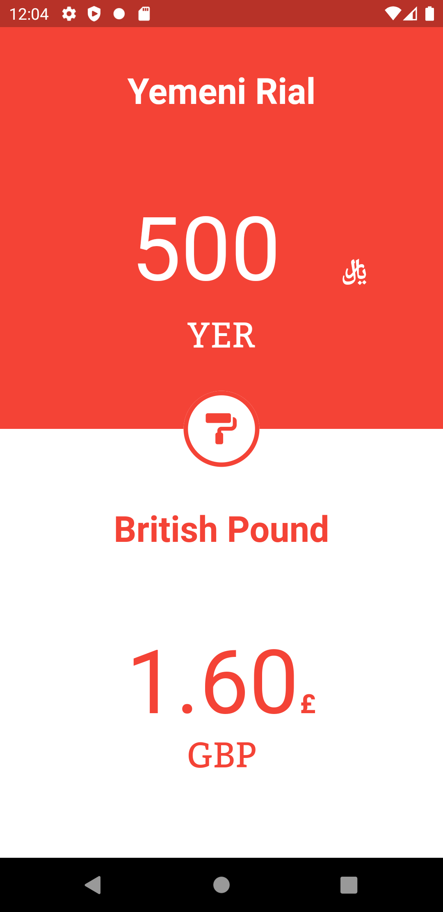
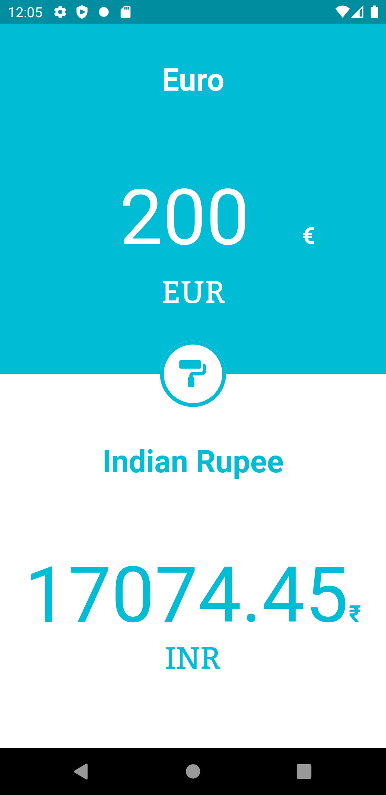
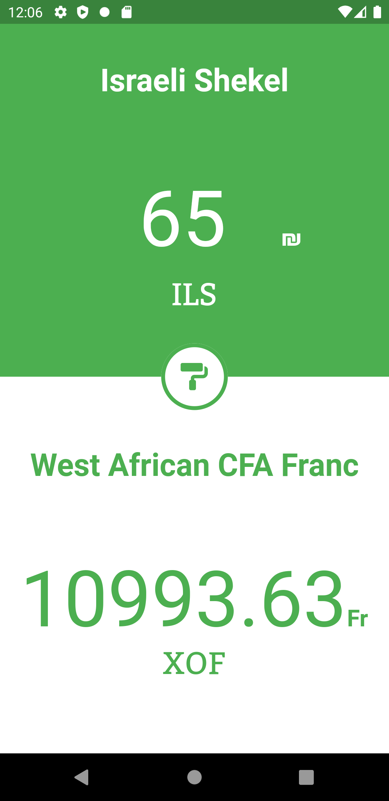

# Currency Flow

A currency converter flutter app.

# Main Features

- Effortless currency conversion.
- Light and changable UI.
- Currencies are updated every hour.

UI inspiration - [Stylish Currency Converter](https://dribbble.com/shots/4816296-Stylish-Currency-Converter-iOS-app)

API used - https://free.currencyconverterapi.com

Contact developer at - development.ionosphere@gmail.com

# Open Source

Anyone is welcome to create issues and pull requests.

# License

**MIT License**

Copyright (c) 2020 Raquibul Islam

[License details](https://github.com/shubha360/Currency-Flow-Flutter/blob/add-license-1/LICENSE)
